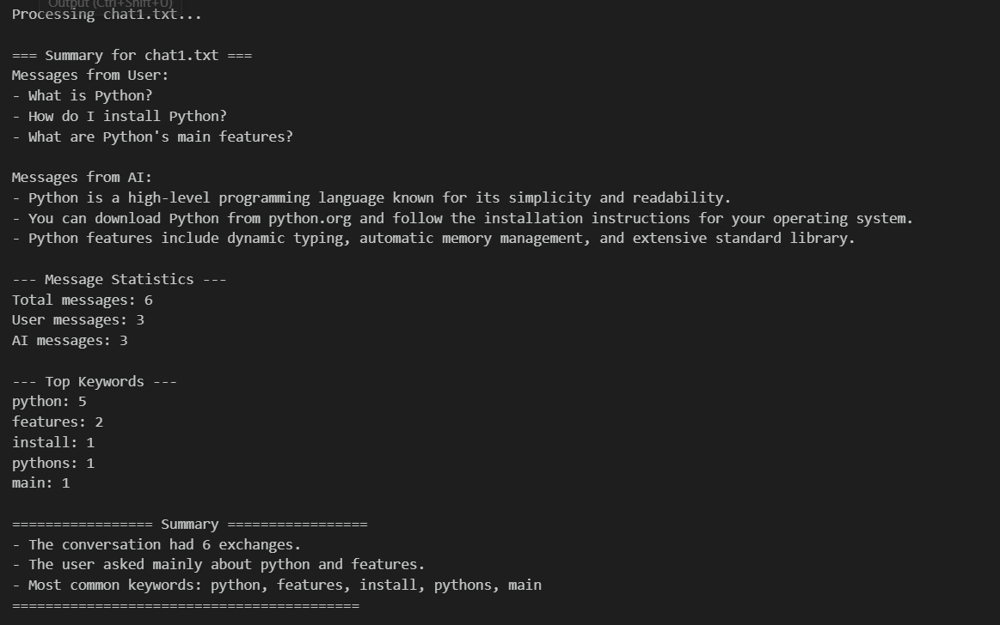
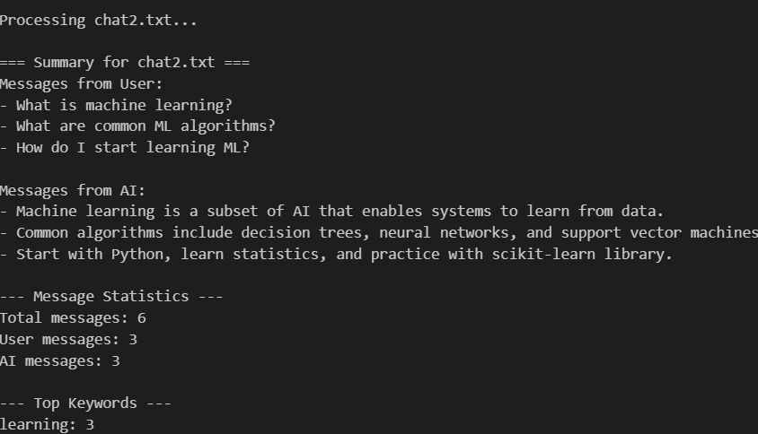
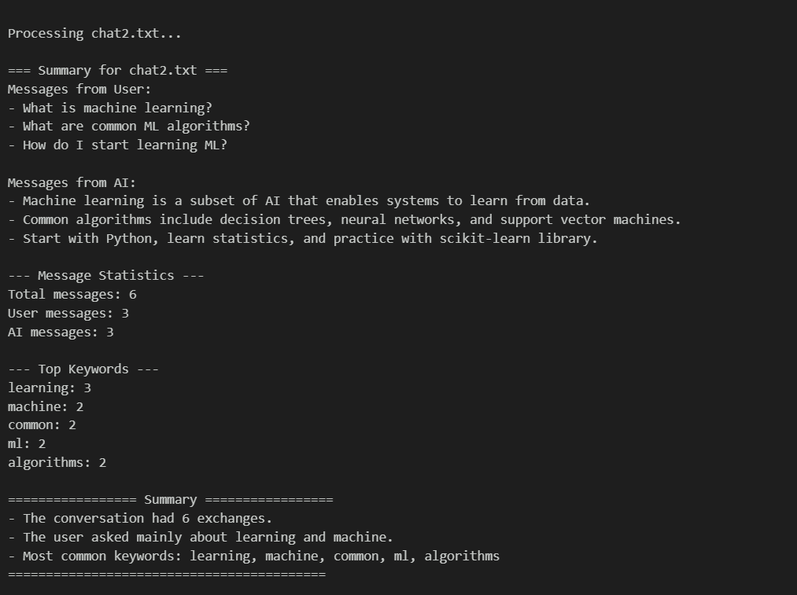
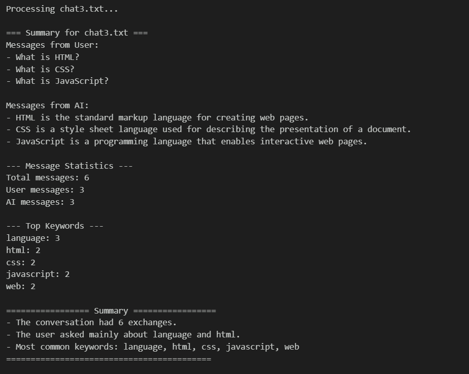
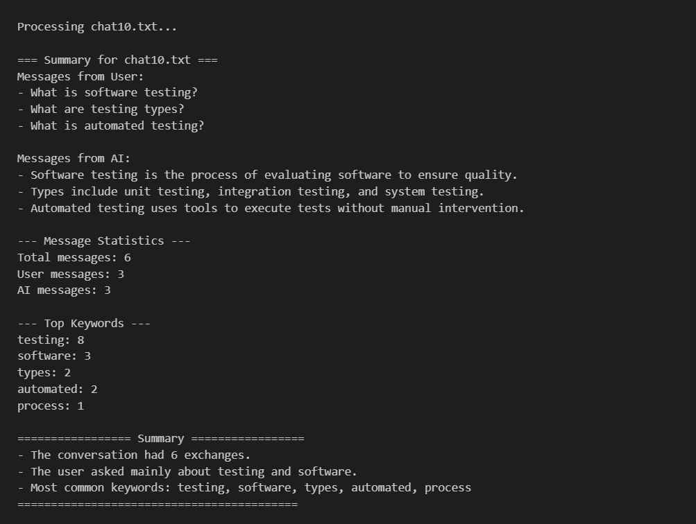
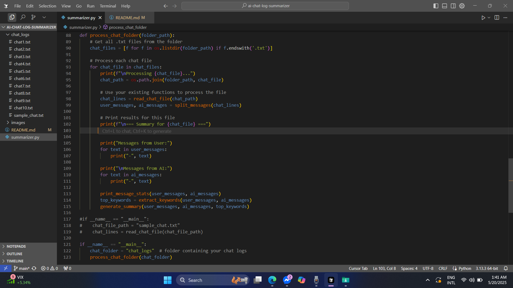

# AI Chat Log Summarizer

A Python tool that processes and summarizes chat logs between users and AI assistants. The tool analyzes multiple chat logs, extracts keywords, and generates meaningful summaries.

## Features

- Process multiple chat log files from a folder
- Extract user and AI messages
- Generate message statistics
- Extract key topics and keywords
- Create comprehensive summaries
- Support for multiple chat formats

## Screenshots

### Program Output Examples







### Project Structure

*Project directory structure and sample chat logs*

## Installation

1. Clone the repository:
```bash
git clone https://github.com/CodeByMoheb/ai-chat-log-summarizer
cd ai-chat-log-summarizer
```

2. Install required packages:
```bash
pip install nltk
```

3. Download required NLTK data:
```python
import nltk
nltk.download('punkt')
nltk.download('stopwords')
nltk.download('punkt_tab')
```

## Project Structure

```
ai-chat-log-summarizer/
├── summarizer.py          # Main script
├── chat_logs/            # Directory for chat log files
│   ├── chat1.txt
│   ├── chat2.txt
│   └── ...
└── README.md
```

## Usage

1. Place your chat log files in the `chat_logs` folder
2. Run the summarizer:
```bash
python summarizer.py
```

### Chat Log Format

Chat logs should follow this format:
```
user: Your message here
ai: AI response here
```

Example:
```
user: What is Python?
ai: Python is a high-level programming language known for its simplicity.
```

## Features in Detail

### 1. Message Processing
- Reads multiple chat log files
- Separates user and AI messages
- Handles different message formats

### 2. Statistics Generation
- Total message count
- User message count
- AI message count
- Message distribution analysis

### 3. Keyword Extraction
- Identifies important topics
- Removes common stopwords
- Counts keyword frequency
- Shows top keywords

### 4. Summary Generation
- Creates conversation summaries
- Highlights main topics
- Provides key insights
- Shows message patterns

## Example Output

```
=== Summary for chat1.txt ===
Total messages: 6
User messages: 3
AI messages: 3

--- Top Keywords ---
python: 3
language: 2
programming: 2

================= Summary =================
- The conversation had 6 exchanges.
- The user asked mainly about python and language.
- Most common keywords: python, language, programming
==========================================
```


## License

This project is licensed under the MIT License - see the LICENSE file for details.

## Acknowledgments

- NLTK library for natural language processing
- Python community for various tools and libraries

## Devolop by
MD. Mohebullah
mohebullah.cse@gmail.com